# Agentic Workflows — Documentation

This directory documents the GitHub Agentic Workflows (`github/gh-aw`) system
implemented in this repository. It is intended for both technical teams
(engineering, platform/SRE, security) and non-technical stakeholders
(product, delivery, management).

> **Scope of this documentation:** description, evidence, and operating/model
> guidance only. No application code, workflow behavior, repository settings,
> secrets, branches, or pull requests were modified to produce these documents.

## Quick facts

| Field | Value |
|---|---|
| Workflow engine | `github/gh-aw` (GitHub Agentic Workflows), compiler `v0.86.2` |
| Agentic workflows (source) | `.github/workflows/ai-pr-review.md`, `ai-ci-diagnose.md`, `ai-fix-pr.md`, `ai-issue-to-draft-pr.md` |
| Generated workflows | `.github/workflows/*.lock.yml` (produced by `gh aw compile`) |
| Engine / model | `engine: copilot`, `model: copilot/hy3-free` (LLM calls routed via BYOK to OpenCode Zen) |
| LLM provider boundary | OpenCode Zen endpoint `https://opencode.ai/zen/v1` (OpenAI-compatible `completions` wire format) |
| Auth to provider | repository secret `OPENCODE_API_KEY` (name only; value not shown) |
| Operating mode | Human-in-the-loop, read-biased assistance with gated safe-outputs |
| Repository owner responsibility | Approval, merge, release, and all policy/compliance decisions remain human |

## What this system does (plain language)

The repository uses GitHub Agentic Workflows to run AI "agents" that help with
routine software-engineering tasks — reviewing pull requests, explaining why CI
failed, proposing code changes, and turning issues into draft pull requests.
The agent is powered by a large language model (here, `hy3-free` served through
OpenCode Zen), but it is **not autonomous**: it can read code and post comments,
and only performs write actions through tightly gated "safe outputs" that the
platform controls. A human always reviews and decides whether to merge.

Think of it as an always-on, junior reviewer/assistant that drafts analysis and
proposals. It never merges, never deploys, and never overrides human decisions.

## Value proposition

- **Faster feedback** — PR review and CI triage start automatically on relevant events.
- **More consistent review/triage** — the same prompt-based checklist applies every time.
- **Less repetitive engineering work** — diagnosis and first-draft fixes are generated, not hand-written.
- **Retained human accountability** — merges, releases, and quality gates stay with people.
- **Controlled and auditable automation** — every run is a GitHub Actions run with logs, artifacts, and a PR comment trail.

## Workflow capabilities vs non-capabilities

| Capability | What the agent does | Human role | Safety boundary | Current status |
|---|---|---|---|---|
| PR review (`ai-pr-review`) | Reads the diff, posts a Markdown review comment with file:line findings | Reviews, decides merge | Read-only + `add-comment` safe-output; no file changes | Verified on PR #8 (run 33270177709) |
| CI diagnosis (`ai-ci-diagnose`) | Explains a failed run and suggests a fix in a comment | Validates and applies | Read-only + `add-comment` | Configured; not yet exercised on a real failing run |
| Change implementation (`ai-fix-pr`) | Implements a requested change on a PR branch (dry-run or apply) | Approves/merges | Gated by `update-pull-request` safe-output; protected paths excluded | Configured; not yet exercised |
| Issue triage (`ai-issue-to-draft-pr`) | Implements an issue and opens a **draft** PR | Reviews/completes the draft | Gated by `create-pull-request` safe-output; protected paths excluded | Configured; not yet exercised |

**Explicit non-capabilities (verified from workflow permissions):** the workflows
request only `contents: read` and `pull-requests: read` (plus `actions: read` /
`issues: read` where needed). They do **not** hold `contents: write`, do **not**
auto-merge, do **not** deploy, and do **not** modify protected paths
(`.github/`, `kubernetes/`, `helm/`, `Dockerfile`, `pyproject.toml`, `tests/`,
`requirements.txt` per the agent prompt).

## High-level lifecycle

```mermaid
flowchart LR
  A[GitHub event: pull_request / workflow_dispatch] --> B[gh-aw workflow .md]
  B --> C[gh aw compile -> .lock.yml]
  C --> D[GitHub Actions run]
  D --> E[pre_activation: auth/guardrails]
  E --> F[activation: build prompt + context]
  F --> G[agent job: coding agent calls OpenCode Zen]
  G --> H[safe_outputs: post comment / PR]
  H --> I[Human reviewer reads comment]
  I --> J[Merge or reject by human]
```

## Who should read what

| Audience | Start with |
|---|---|
| Product / Business | `README.md` (this file), `case-study-pr-8.md` (business view) |
| Engineering | `architecture.md`, `operating-model.md`, `case-study-pr-8.md` |
| Platform / SRE | `architecture.md`, `security-and-governance.md`, `operating-model.md` |
| Security / Compliance | `security-and-governance.md`, `case-study-pr-8.md` (control points) |
| Maintainers | all of the above; `glossary.md` for terms |

## Document index

- [architecture.md](architecture.md) — technical architecture, diagrams, data flow
- [operating-model.md](operating-model.md) — triggers, lifecycle, responsibilities, definitions of done
- [security-and-governance.md](security-and-governance.md) — controls, threat model, cost/audit
- [case-study-pr-8.md](case-study-pr-8.md) — evidence-based analysis of PR #8
- [glossary.md](glossary.md) — terms and definitions
