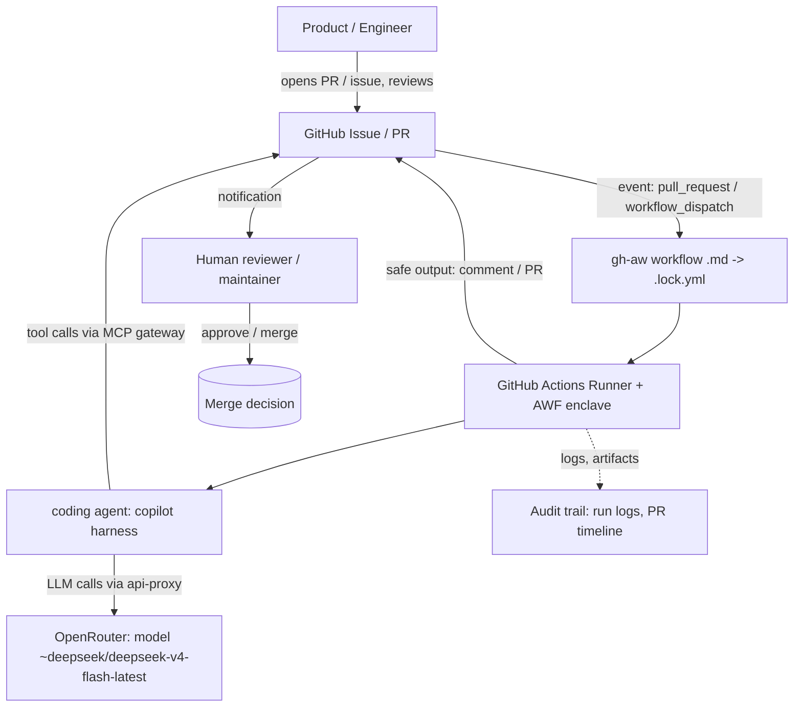
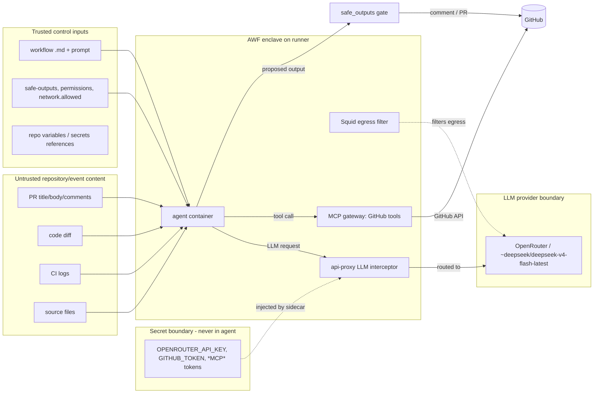
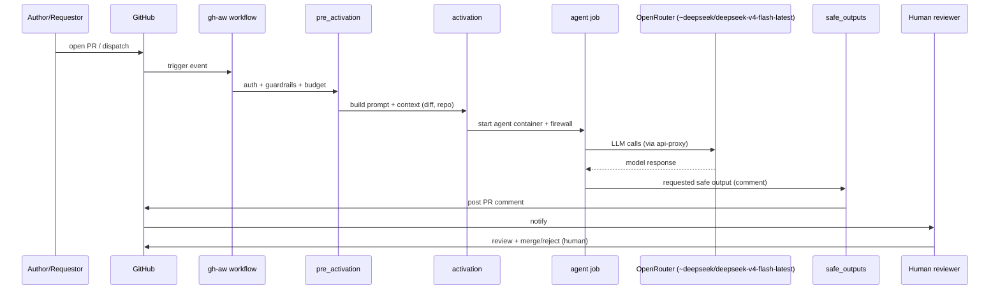
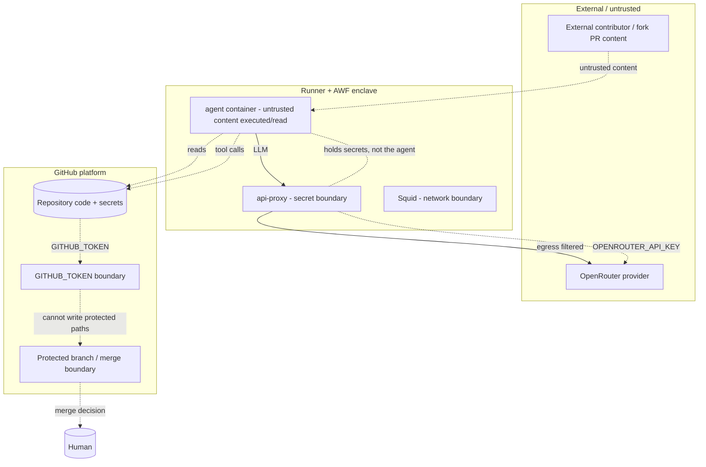

# Architecture

Technical reference for the agentic workflow system implemented in this repository
using GitHub Agentic Workflows (`gh-aw`, compiler `v0.87.10`).

**Confidence legend:** *(Verified)* = directly observed in checked-in files or
run metadata; *(Inferred)* = reasonable deduction from gh-aw behavior/manifest;
*(Recommended)* = suggested future control; *(Unknown)* = not available.

## Components and sources (verified)

| Component | Evidence |
|---|---|
| Agentic workflow sources | `.github/workflows/ai-pr-review.md`, `ai-ci-diagnose.md`, `ai-fix-pr.md`, `ai-issue-to-draft-pr.md` |
| Generated GitHub Actions workflows | `.github/workflows/*.lock.yml` (header: `gh-aw (v0.87.10)`, `agent_id: copilot`; model resolved at runtime from `vars.OPENROUTER_MODEL`) |
| gh-aw setup action | `github/gh-aw-actions/setup@bc8c008a…` (v0.87.10) per lock manifest |
| Firewall images | `ghcr.io/github/gh-aw-firewall/{agent,api-proxy,squid}:0.28.10`, `gh-aw-mcpg:v0.4.14`, `github-mcp-server:v1.11.0` |
| LLM routing | `engine.env`: `COPILOT_PROVIDER_BASE_URL=${{ vars.OPENROUTER_BASE_URL }}` (repo variable, value `https://openrouter.ai/api/v1`), `COPILOT_PROVIDER_WIRE_API=completions`, `COPILOT_PROVIDER_API_KEY=${{ secrets.OPENROUTER_API_KEY }}` (in every workflow `.md`) |
| Secrets in manifest | `OPENROUTER_API_KEY`, `COPILOT_GITHUB_TOKEN`, `GH_AW_GITHUB_TOKEN`, `GH_AW_GITHUB_MCP_SERVER_TOKEN`, `GITHUB_TOKEN` |

## How gh-aw works here (verified + inferred)

1. Authors edit Markdown workflow files (`.md`). A CI/build step runs
   `gh aw compile`, producing checked-in `.lock.yml` GitHub Actions workflows.
   *(Verified: lock header says "To update this file, edit the corresponding .md
   file and run: gh aw compile".)*
2. On a trigger (e.g., `pull_request`), GitHub runs the compiled workflow.
3. gh-aw spins up an **Agent Workflow Firewall (AWF)** enclave: a Squid proxy
   (egress filtering), an **api-proxy** sidecar (LLM traffic interception), and
   an **MCP gateway** (exposes GitHub tools to the agent).
   *(Inferred from manifest container list and standard gh-aw architecture.)*
4. The **Copilot engine harness** (`engine: copilot`) launches the coding-agent
   CLI inside the agent container. All LLM requests go through the api-proxy.
5. The api-proxy is configured (via `COPILOT_PROVIDER_BASE_URL`, set from the repo
   variable `OPENROUTER_BASE_URL`) to forward those requests to **OpenRouter**
   (`https://openrouter.ai/api/v1`) using the OpenAI `completions` wire format,
   authenticated with `OPENROUTER_API_KEY`. *(Provider switched from OpenCode Zen
   to OpenRouter; re-verify the proxy target in `awf-config.json` on the next run.)*
6. The model that actually generates the response is **`~deepseek/deepseek-v4-flash-latest`**
   on OpenRouter, even though the harness is the Copilot CLI. It is set via
   `COPILOT_MODEL=${{ vars.OPENROUTER_MODEL }}` in `engine.env` (bare provider id,
   no `copilot/` prefix — passed straight to OpenRouter). The leading `~` is an
   OpenRouter router alias that resolves to the current DeepSeek V4 Flash snapshot,
   so the pin doesn't go stale. This model is **not** a free tier; calls cost tokens.
7. Agent output is captured, and any **safe output** (e.g., a PR comment) is
   applied by a gated `safe_outputs` job, not by the agent directly.

## System context diagram

## Component / data-flow diagram

## Workflow lifecycle sequence

## Trust-boundary diagram

## Repository context supplied to the agent

- PR/issue text, comments, and the code diff *(verified: prompt instructs review of
  "PR title, body, comments, diff, and all repository files")*.
- A checked-out copy of the repository at the PR head *(inferred: standard
  `actions/checkout` in the generated workflow)*.
- Suggested deterministic commands: `pytest tests/ -m "not integration" -q` and
  `flake8 . --count --select=E9,F63,F7,F82` *(verified in prompt)*.

## Agent output mechanisms

| Output | Mechanism | Evidence |
|---|---|---|
| PR comment | `safe-outputs: add-comment: null` | `ai-pr-review.md:34` |
| PR update | `safe-outputs: update-pull-request: null` | `ai-fix-pr.md:39` |
| Draft PR | `safe-outputs: create-pull-request: null` | `ai-issue-to-draft-pr.md:33` |

## Deterministic quality gates (independent of the agent)

- Unit tests: `pytest tests/ -m "not integration"` *(verified command in prompts)*.
- Lint: `flake8` selective codes *(verified)*.
- Branch protection and human approval remain the merge gate *(verified: workflows
  request only read scopes; no auto-merge step exists)*.

## Observability / audit sources

- GitHub Actions run logs and job timeline (run `33270177709` for PR #8).
- Artifacts: `agent` (includes `agent-stdio.log`, `awf-config.json`, proxy logs).
- PR timeline and the posted AI comment.
- Git history (`git log`) for the workflow and application changes.
