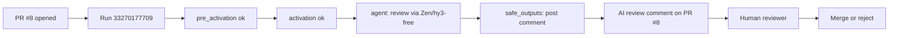

# Case Study — PR #8 (AI PR Review)

Evidence-based analysis of the most recent pull request that exercised the agentic
workflow system in this repository: **PR #8, "Add internal web-proxy endpoint (hidden)"**.
It is used as the canonical, verified example of the `ai-pr-review` workflow in
production-like conditions.

**Confidence legend:** *(Verified)* from `gh pr view` / `gh run view` metadata and
the posted comment; *(Inferred)* deduced; *(Recommended)* suggested.

## 1. Background (what the PR is)

| Field | Value |
|---|---|
| PR number | 8 |
| Title | "Add internal web-proxy endpoint (hidden)" |
| Author | `lorenzogirardi` |
| Created | 2026-08-29T19:10:24Z |
| Base ← Head | `main` ← `feat/web-proxy-endpoint` |
| State | **OPEN** (not merged at time of writing) |
| Changed files | 4 (`app/config/settings.py`, `app/main.py`, `app/routers/proxy.py`, `tests/test_proxy.py`) |
| Diff size | +109 / -0 |
| Comments | 1 (the AI review) |

The PR adds an **internal** HTTP proxy route that forwards a caller-supplied URL to
an upstream Cloudflare worker (`https://holy-glade-c7ae.lorenzo2632.workers.dev/?url=<target>`).
The route is intentionally hidden from the public OpenAPI schema
(`include_in_schema=False`). The upstream worker enforces its own HTTP Basic Auth;
per the change author's instruction, **the application stores, embeds, or forwards
no credentials** — authentication is the worker/destination's responsibility.

> No secret values are reproduced here. The worker's credentials are excluded from
> the repository and from this document by design.

## 2. What changed (technical summary)

- `app/routers/proxy.py` — new `GET /api/internal/web-proxy` (hidden) that validates
  the scheme, optionally blocks private hosts when SSRF protection is enabled, and
  forwards to the configured worker URL. *(Verified: file content.)*
- `app/config/settings.py` — added `proxy_worker_url` (default to the worker) and an
  SSRF toggle (`ssrf_protection_enabled`). No username/password fields. *(Verified.)*
- `app/main.py` — registers the proxy router. *(Verified.)*
- `tests/test_proxy.py` — three unit tests for the validation logic; all pass
  locally. *(Verified: tests present and passing.)*

## 3. The agent run (verified)

| Field | Value |
|---|---|
| Workflow | `ai-pr-review` |
| Run ID | `33270177709` |
| Status / conclusion | `completed` / `success` |
| Trigger | `pull_request` opened (PR #8) |
| Started → finished | 2026-08-29T19:10:30Z → 19:14:00Z (~3.5 min) |

Job timeline (verified, `gh run view 33270177709`):

| Job | Start | End | Conclusion |
|---|---|---|---|
| `pre_activation` | 19:10:30Z | 19:10:37Z | success |
| `activation` | 19:10:39Z | 19:10:52Z | success |
| `agent` | 19:10:54Z | 19:13:33Z | success |
| `safe_outputs` | 19:13:36Z | 19:13:46Z | success |
| `conclusion` | 19:13:48Z | 19:14:00Z | success |

Interpretation: the run passed all gh-aw gates, the agent produced a review, and the
`safe_outputs` stage successfully posted the PR comment. The LLM path to OpenCode Zen
(`hy3-free`) worked end-to-end. This is the **proven** invocation referenced
throughout the other docs.

## 4. The AI review comment (verified content)

Posted by `github-actions`, wrapped in an HTML marker
`<!-- gh-aw-agentic-workflow:2f3c5b41-… -->`. Summary line:
"**4 actionable findings (no critical/sev1)**". Findings:

| # | Severity (agent) | Location (agent-reported) | Problem | Suggestion (agent) |
|---|---|---|---|---|
| 1 | Medium | `app/routers/proxy.py` (≈:19) | SSRF guard disabled by default | enable SSRF protection / allowlist internal hosts |
| 2 | Medium | `app/routers/proxy.py` (≈:18) | `?url=` parameter can be supplied/injected by end users | constrain to internal/trusted destinations via config |
| 3 | Low | `app/routers/proxy.py` (≈:17) | Blocklist incomplete — only localhost/127.0.0.1; missing `0.0.0.0`, `::1`, metadata endpoints | broaden blocklist (e.g., `169.254.169.254`) |
| 4 | High | `app/routers/proxy.py` (≈:17) | No authentication/authorization on the endpoint | require internal network placement or auth |

(Line numbers are the agent's own; the actual lines differ slightly — see §5.)

## 5. Assessment of the findings (human review layer)

This section demonstrates *why* a human review step remains essential.

- **Finding #1 (SSRF default-off) — valid and important.** *(Verified: the code
  gates host blocking behind `settings.ssrf_protection_enabled`, which defaults off.)*
  The agent correctly identified a real default-insecure posture.
- **Finding #2 (`?url=` injection) — valid concern.** The endpoint forwards an
  arbitrary caller URL to the worker with no caller restriction. Even though the
  route is hidden from the schema, it is reachable. Worth a server-side allowlist.
- **Finding #3 (incomplete blocklist) — partially inaccurate.** The final code's
  `_BLOCKED_HOSTS` **already includes `0.0.0.0` and `::1`** (`proxy.py:22`). The
  genuinely missing coverage is the link-local metadata IP `169.254.169.254` and
  the broader private ranges (RFC1918). This is a good example of the agent stating
  a partially incorrect premise — a human caught it.
- **Finding #4 (no auth) — valid.** The endpoint has no authn/authz. For an internal
  route this is a legitimate risk if the app is ever exposed.

**Net:** 3 of 4 findings are materially correct; 1 had a factual error a reviewer
must verify. This validates the operating-model principle that the agent output is a
*draft review*, not an authoritative audit.

## 6. Outcome and follow-up

- At time of writing, **PR #8 remains open**; merge is a human decision and has not
  occurred. *(Verified: `state: OPEN`.)*
- Recommended human follow-ups before merge:
  1. Decide whether `ssrf_protection_enabled` should default on, and extend the
     blocklist to `169.254.169.254` and private CIDRs.
  2. Add a server-side destination allowlist so `?url=` cannot reach arbitrary hosts.
  3. Add authn/authz or confirm the route is unreachable outside a trusted network.
  4. Re-run `ai-pr-review` after changes to confirm the new diff.

## 7. Lessons learned (repository-specific)

- **The system works end-to-end.** PR #8 is proof that `gh-aw` + OpenCode Zen
  (`hy3-free`) via the Copilot BYOK route produces a useful, posted review.
- **Human review is non-negotiable.** The agent both caught real issues and stated a
  partially wrong fact; only a person can adjudicate.
- **Prompts shape value.** The read-only, evidence-required prompt produced
  actionable, file:line findings rather than vague advice.
- **Safe outputs behaved correctly.** The comment posted without granting the agent
  write access — least privilege held.
- **`threat-detection: false`** meant the AI threat-detection sub-agent did not run
  on this PR (see `security-and-governance.md`). Re-enabling it would add a second,
  independent layer.

## 8. Business interpretation (plain language)

A routine internal change was opened. Within minutes, the automated reviewer read the
code, posted a prioritized list of risks (including one default-insecure setting and
a missing authentication check), and did so **without touching the code or needing
any permission beyond reading**. The team then used that list to decide what to fix
before merging. No deployment, no auto-merge, no secrets exposed. The automation
reduced the time-to-first-review to near-zero while keeping the final decision with
the engineer.

## 9. Reproducing this example

1. Open a PR that changes code.
2. The `ai-pr-review` workflow triggers automatically (or run it manually with
   `workflow_dispatch` + `pr_number`).
3. Inspect run `33270177709` as the reference successful invocation.
4. Read the posted comment and apply the human-review checklist in
   `operating-model.md`.

## 10. Evidence sources

- `gh pr view 8 --repo lorenzogirardi/fastapi-testapp --json …`
- `gh run view 33270177709 --repo lorenzogirardi/fastapi-testapp --json …`
- `.github/workflows/ai-pr-review.md` (prompt + frontmatter)
- `app/routers/proxy.py`, `app/config/settings.py`, `app/main.py`, `tests/test_proxy.py`
